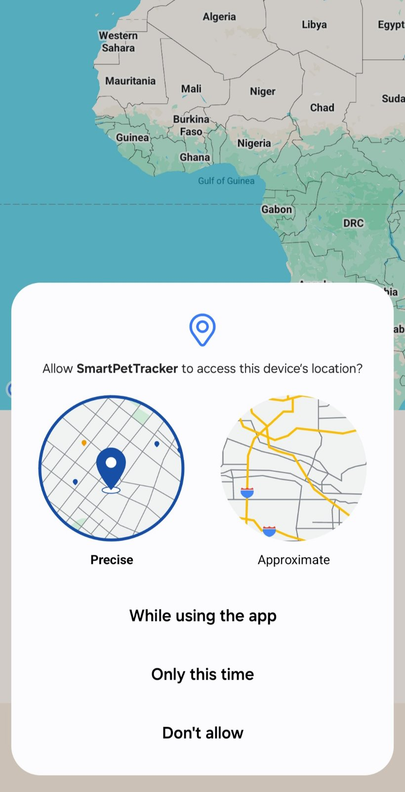

**SmartPet Tracker is an Android application that allows you to track your pet in real-time using SmartTag and GPS.
It provides geofencing alerts, saves location history to the cloud, and supports exporting path history as CSV.**

**Features ✨**
📍 Live Pet Tracking: See your pet's current location on the map in real-time.

🛡️ Geofence Alerts: Get notified if your pet exits or re-enters the safe zone.

🗺️ Home Location: Set a custom home location manually or using your current location.

☁️ Save and Load Paths: Upload and download your pet's path history from Firebase.

📤 Export to CSV: Export tracked paths into CSV files for backup or analysis.

🧹 Clear Path History: Easily clear the recorded paths.

🔍 SmartTag Connection: Automatically detect and connect to your pet's Bluetooth SmartTag.

**Screenshots**

### Home Screen

### Map Screen

### Settings Screen

**Installation 📲**
Clone or download the project from GitHub.

Open it in Android Studio.

Connect your Android device (or use an emulator with Google Play Services).

Set up your Google Maps API key in AndroidManifest.xml.

Run the project!

**Requirements 🛠**
Android 8.0 (API level 26) or higher

Bluetooth support for SmartTag tracking

Location Services (GPS) enabled

Firebase Realtime Database configured (optional but recommended)

**Permissions 🔐**
The app requires the following permissions:

ACCESS_FINE_LOCATION: To track live location.

BLUETOOTH_SCAN and BLUETOOTH_CONNECT: To detect and connect to SmartTag.

ACCESS_COARSE_LOCATION: For Bluetooth LE scanning.

POST_NOTIFICATIONS: (Android 13+) To send geofence exit notifications.

⚠️ Permissions are requested dynamically at runtime.

**Firebase Setup ☁️**
If you want to store and load path history from the cloud:

Go to Firebase Console.

Create a new project.

Add an Android App to the project and download the google-services.json file.

Place the google-services.json file inside your project's app/ folder.

Enable Realtime Database in Firebase Console.

Set basic rules for development (example):
{
  "rules": {
    ".read": true,
    ".write": true
  }
}
⚠️ Only for development. In production, set proper authentication and security rules.

Add Firebase dependencies in build.gradle.kts (already included in this project)

**How It Works 🚀**
When the app starts, it tries to find and connect to a SmartTag nearby.

The app continuously tracks the pet's position using GPS.

If the pet moves outside the geofence, the app sends a notification.

You can save the recorded path to Firebase or export it locally.

You can select any past day to view, download, or export historical path data.

**Technologies Used 🧩**
Kotlin

Jetpack Compose

Google Maps Compose

Firebase Realtime Database

Bluetooth Low Energy (BLE)

Android Location Services

Material3 UI Components

**License 📜**
This project is licensed under the MIT License.

**Author ✍️**
Florentia Pattidou
